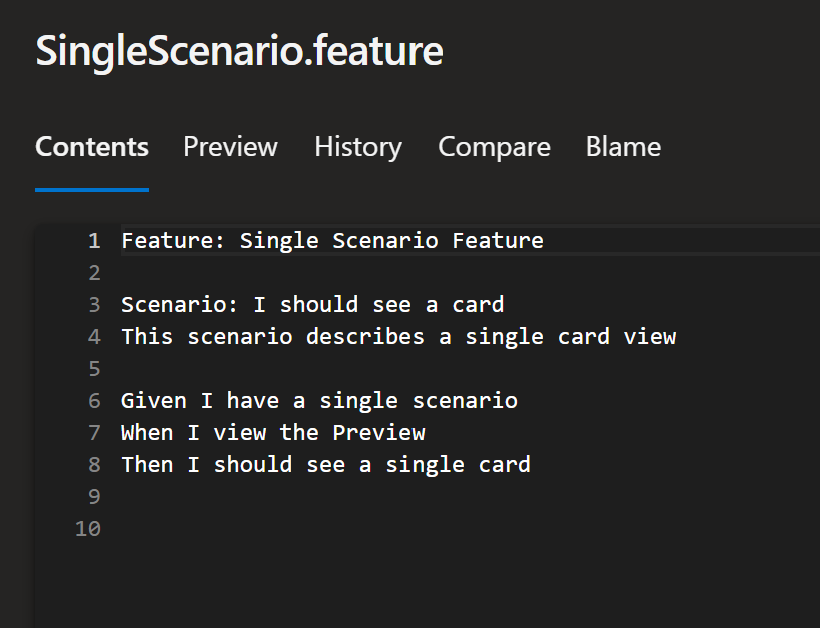
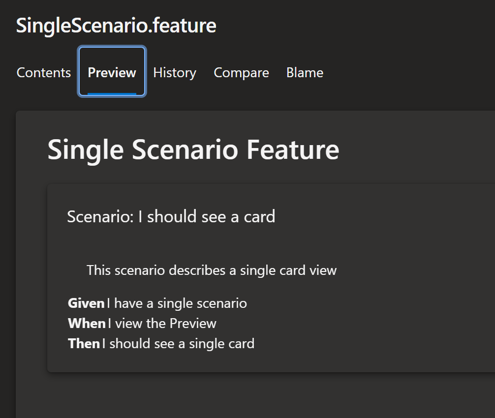
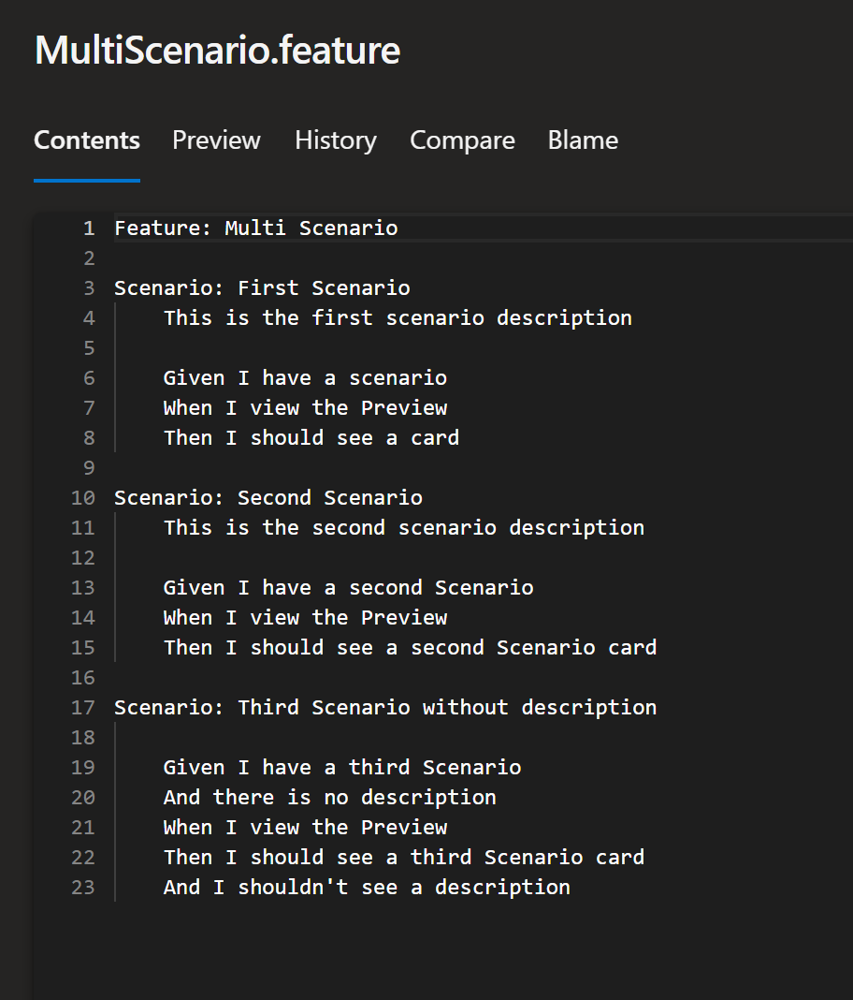
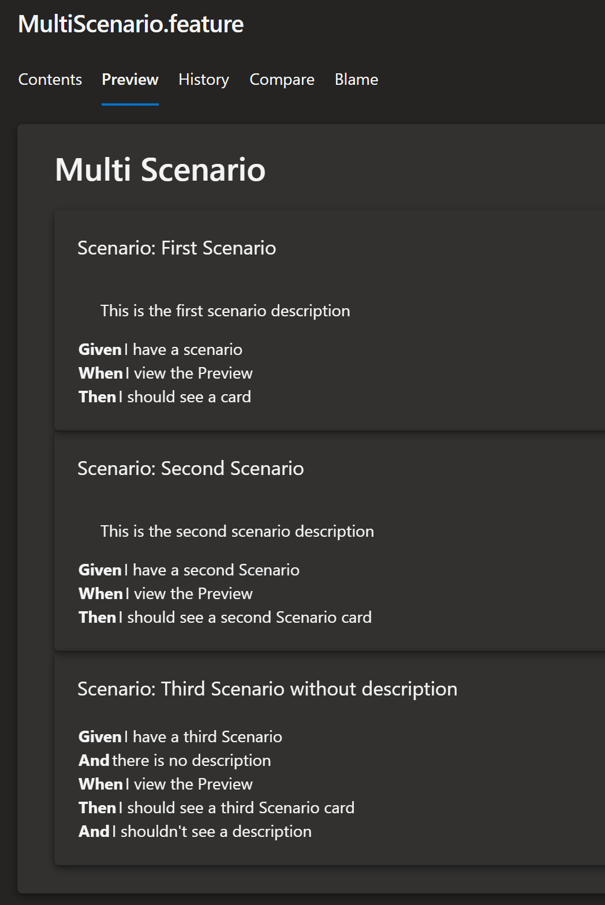
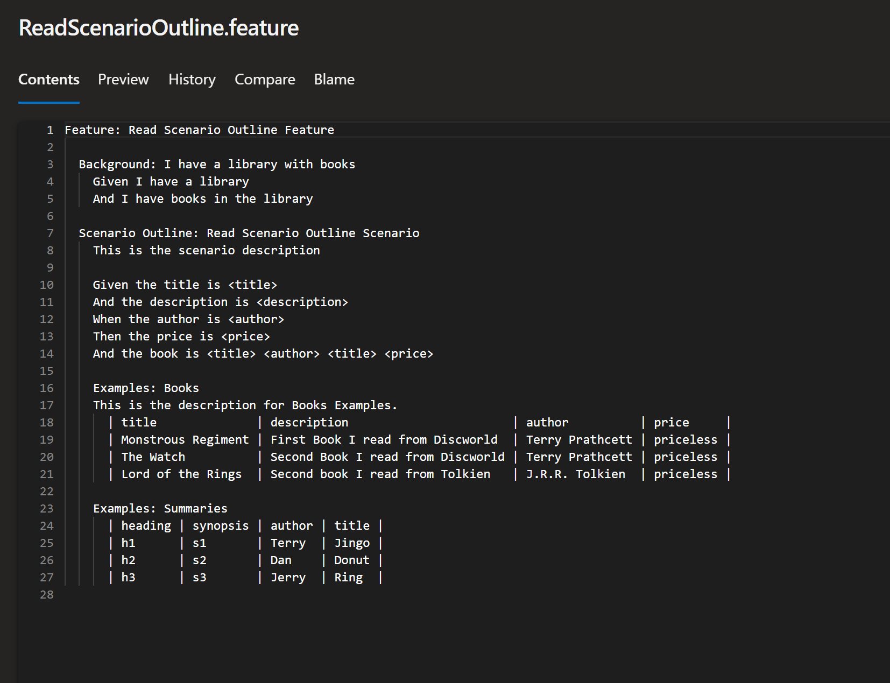
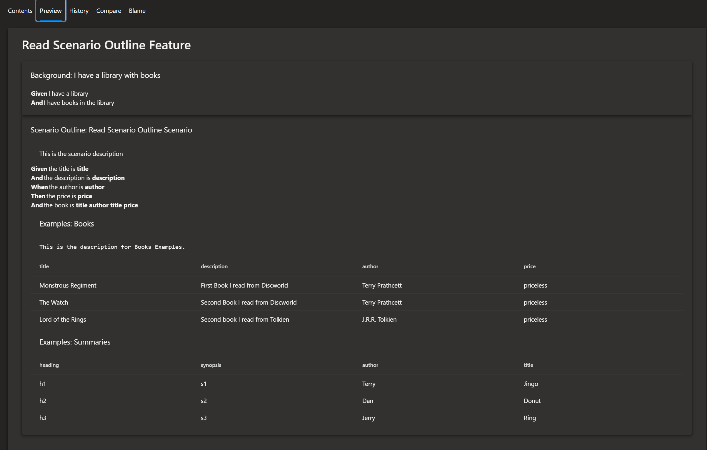

This extension renders the gherkin files with syntax highlighting and interactive view for Scenario Outlines with Examples.

It supports 

## Single Scenarios

## Multi Scenarios

## Scenario Outlines

